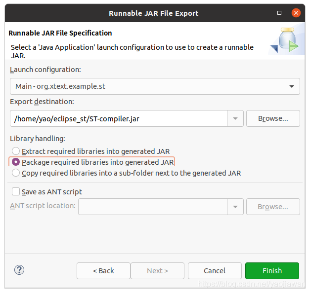

#课题
Eclipse Xtext 是用于开发编程语言和领域特定语言的框架，包括解析器、链接器、类型检查器、编译器以及对 Eclipse、任何支持语言服务器（LSP）协议的编辑器和您最喜欢的 web 浏览器的编辑支持。


## 快速入门

#### 创建项目 

选项导航：File → New → Project… → Xtext → Xtext project
填入如下值

| key                  | value                               |
| -------------------- | ----------------------------------- |
| Project name:        | org.example.domainmodel             |
| Language name:       | org.example.domainmodel.Domainmodel |
| DSL-File extensions: | dmodel                              |

会自动生成如下目录结构

|                                  |                                                                                                           |
| -------------------------------- | --------------------------------------------------------------------------------------------------------- |
| org.example.domainmodel          | **The grammar definition and all language-specific components (parser, lexer, linker, validation, etc.)** |
| org.example.domainmodel.ide      | Platform-independent IDE functionality (e.g. services for content assist)                                 |
| org.example.domainmodel.tests    | Unit tests for the language                                                                               |
| org.example.domainmodel.ui       | The Eclipse editor and other workbench related functionality                                              |
| org.example.domainmodel.ui.tests | UI tests for the Eclipse editor                                                                           |

### 一些概念

#### Inject
Xtext 框架使用 com.google.inject 库进行依赖注入，注册不同的语言服务（如 GrammarAccess，Formatter）
#### Grammar Language

名为 [xtext](https://www.eclipse.org/Xtext/documentation/301_grammarlanguage.html) 的 DSL，用于定义语言语法，以及与语义对象的映射关系
- 语法对象：抽象语法树的节点，与源代码对应，Parsing 过程将字符串转换为多个语法对象构造的树
- 语义对象：语义分析处理的对象，比如类型对象，模块对象等

Xtext 框架设计原则是，用 xtext 定义语法以及语义对象，在解析过程中，同时构造出语义对象。其他的语言服务将处理这些语义对象。语义对象使用 [EMF Ecore 模型]( https://www.eclipse.org/Xtext/documentation/308_emf_integration.html#model-metamodel)作为规范
#### Module
如 DslRuntimeModule，见 [here](https://www.eclipse.org/Xtext/documentation/302_configuration.html)
类似于依赖注入中的 Module，提供当前 DSL 各种语言服务的类
要使用 DSL 的语言功能（如编译器或 Language Server），通过 Injector 获取 Module，然后调用对应的方法使用

#### Language Implementation
<https://www.eclipse.org/Xtext/documentation/303_runtime_concepts.html>

实现语言的各种功能

#### CodeGeneration

用于将 AST 解释执行，或翻译为其他代码，如 Model -> Java, YAML 等
实现 `IGenerator2` 接口
关注对象
- 当前待生成的资源（语法树子树根节点）
- 输出管理（输出的内容，输出的文件路径）
- 引用其他的对象
#### Validation

用途
- 静态分析实现 Lint，检测模型是否满足约束
- 静态分析输出 Errors 与 Warnings，通过 Resource.getErrors() 与 Resource.getWarnings() 获取
包括：
- Automatic Validation
	- Lexer/Parser: 语法校验
	- Linker：交叉引用校验
		- 利用 Scope（符号表）等信息，执行校验
		- 可能会跨多个模块
	- Serializer：Concrete Syntax Validation collapsed:: true
		- 具体的语法验证，当验证通过，说明模型可以被正确序列化
		- TODO: 使用场景？用于模型序列化后，再反序列化回来？
- Custom Validation
	- 实现 AbstractDslValidator
#### Linking

实现交叉引用，需要完成两步：
- 在 xtext grammar 文件中，定义交叉引用
- 通过 Scoping API 声明 Linking 的语义

Lazy Link
- Xtext 建议使用 Lazy Link
- 通过创建 Proxy 对象实现，当实际访问该 Proxy 对象时，才进行 resolve Scoping
- 通过 Scoping API 定义如何通过引用找到引用的对象

### 编写语法

转换规则在主 java 包的 `xxx.xtext` 文件中编写
`
xtext 语法参考：<https://eclipse.dev/Xtext/documentation/301_grammarlanguage.html>

考虑实现对于以下模型语法的识别：
```D
datatype String
 
entity Blog {
    title: String
    many posts: Post
}
 
entity HasAuthor {
    author: String
}
 
entity Post extends HasAuthor {
    title: String
    content: String
    many comments: Comment
}
 
entity Comment extends HasAuthor {
    content: String
}
```


```D
grammar org.example.domainmodel.Domainmodel with
                                      org.eclipse.xtext.common.Terminals
 
generate domainmodel "http://www.example.org/domainmodel/Domainmodel"
 
Domainmodel:
    (elements+=Type)*;
 
Type:
    DataType | Entity;
 
DataType:
    'datatype' name=ID;
 
Entity:
    'entity' name=ID ('extends' superType=[Entity])? '{'
        (features+=Feature)*
    '}';
 
Feature:
    (many?='many')? name=ID ':' type=[Type];
```

The first rule in a grammar is always used as the start rule.
```D
Domainmodel:
    (elements+=Type)*;
```
The rule Type delegates to either the rule DataType or (|) the rule Entity.

The rule DataType starts with a keyword 'datatype', followed by an identifier which is parsed by a rule called ID. The rule **ID** is defined in the super grammar org.eclipse.xtext.common.Terminals and *parses a single word*, a.k.a identifier. You can navigate to the declaration by using `F3` on the rule call. **The value returned by the call to ID is assigned (=) to the feature name.**
```D
DataType:
    'datatype' name=ID;
```

- `?` 表示可选
- 两个花括号之间可以有任意个 feature
- the parser rule Entity is not called here, but only a single identifier (the ID-rule) is parsed. The actual Entity to assign to the superType reference is resolved during the linking phase. 
```D
Entity :
    'entity' name=ID ('extends' superType=[Entity])? '{'
        (features+=Feature)*
    '}';
```

-  simple assignments：
	- uses a plain equal sign (=)
	- a multi-value assignment uses a plus-equals (+=).
	- (?=) implies that the feature many is of type boolean. 
```D
Feature:
    (many?='many')? name=ID ':' type=[Type];
```

#### 定义导入

使用 Xtext 可以以非常方便的方式定义导入。
```D
Import:
    'import' importedNamespace=QualifiedNameWithWildcard;
 
QualifiedNameWithWildcard:
    QualifiedName '.*'?;
```

#### 模板表达式

«content» 中的内容是修改模板的脚本。它可以有 IF，WHILE，FOR 等语句，也可以调用方法
- 使用 CTRL + < 和 CTRL + > 输入« 和 » 符号

IF：
```D

def someHTML(Paragraph p) '''
  <html>
    <body>
      «IF p.headLine != null»
        <h1>«p.headline»</h1>
      «ELSE»
        <h1>«p.standartHeadline»</h1>
      «ENDIF»
      <p>
        «p.text»
      </p>
    </body>
  </html>
'''
```

FOR 循环
```D
def someHTML(Paragraph p) '''
  <html>
    <body>
      «IF p.headLine != null»
        <h1>«p.headline»</h1>
      «ELSE»
        <h1>«p.standartHeadline»</h1>
      «ENDIF»
      <p>
        «p.text»
      </p>
    </body>
  </html>

```

### 运行

生成语言构件：在语法编辑器中单击鼠标右键并选择 Run As → Generate Xtext Artifacts. 此操作将生成解析器和文本编辑器以及一些附加的基础设施代码

#### 集成到 EclipseIDE

现在我们可以测试 Eclipse IDE 集成了。如果您在包资源管理器中右键单击项目 org.example.domainmodel 并选择 Run as→Eclipse Application，则会创建并启动一个新的运行配置，该配置将启动包括新语言插件在内的另一个→实例。在新实例中，创建一个您选择的新项目，例如文件→新建→项目…→Java 项目，并在其中创建一个文件扩展名为您在开头选择的文件扩展名( `*.dModel` )的新文件。这将打开生成的实体编辑器。尝试一下，发现代码完成、语法突出显示、语法验证、链接错误、格式设置、(快速)大纲视图、超链接、查找引用、折叠、重命名重构等默认功能。


#### 编写 CodeGenerator

首先打开 `org.example.domainmodel.generator` 包中的 yyy.xtend 文件，该文件描述如何通过模型生成代码

编写策略是找到资源中的所有实体，并为每个实体（在语法 xtext 中定义的）触发代码生成。
将实体名称转换为对应的 java 文件名
```Java
override void doGenerate(Resource resource, IFileSystemAccess2 fsa, IGeneratorContext context) {
    for (e : resource.allContents.toIterable.filter(Entity)) {
        fsa.generateFile(
            e.fullyQualifiedName.toString("/") + ".java",
            e.compile)
    }
}
```

然后，编写实体的实际模板代码，即 Entity.compile 函数。该函数使用一个多行的模板字符串描述如何生成相应代码，其中使用 `<<值>>` 的形式动态插入内容：
```Java
private def compile(Entity e) '''
    «IF e.eContainer.fullyQualifiedName !== null»
        package «e.eContainer.fullyQualifiedName»;
    «ENDIF»
        
    public class «e.name» «IF e.superType !== null
            »extends «e.superType.fullyQualifiedName» «ENDIF»{
        «FOR f : e.features»
            «f.compile»
        «ENDFOR»
    }
'''
```

代码生成器的全部代码如下：
```Java
package org.example.domainmodel.generator
 
import com.google.inject.Inject
import org.eclipse.emf.ecore.resource.Resource
import org.eclipse.xtext.generator.AbstractGenerator
import org.eclipse.xtext.generator.IFileSystemAccess2
import org.eclipse.xtext.generator.IGeneratorContext
import org.eclipse.xtext.naming.IQualifiedNameProvider
import org.example.domainmodel.domainmodel.Entity
import org.example.domainmodel.domainmodel.Feature
 
class DomainmodelGenerator extends AbstractGenerator {
 
    @Inject extension IQualifiedNameProvider
 
    override void doGenerate(Resource resource, IFileSystemAccess2 fsa, IGeneratorContext context) {
        for (e : resource.allContents.toIterable.filter(Entity)) {
            fsa.generateFile(
                e.fullyQualifiedName.toString("/") + ".java",
                e.compile)
        }
    }
 
    private def compile(Entity e) '''
        «IF e.eContainer.fullyQualifiedName !== null»
            package «e.eContainer.fullyQualifiedName»;
        «ENDIF»
        
        public class «e.name» «IF e.superType !== null
                »extends «e.superType.fullyQualifiedName» «ENDIF»{
            «FOR f : e.features»
                «f.compile»
            «ENDFOR»
        }
    '''
 
    private def compile(Feature f) '''
        private «f.type.fullyQualifiedName» «f.name»;
        
        public «f.type.fullyQualifiedName» get«f.name.toFirstUpper»() {
            return «f.name»;
        }
        
        public void set«f.name.toFirstUpper»(«f.type.fullyQualifiedName» «f.name») {
            this.«f.name» = «f.name»;
        }
    '''

```

#### 使用 CodeGenerator

Xtend 的一个重要的应用是实现 DSL 语言的代码生成。而 DSL 语言是通过 Xtext 来定义的。当你建立一个 DSL 的语法文件 Test.mydsl 后，你可以生成一个具有你的 DSL 插件的 Eclipse 编辑器。然后在这个编辑器上你可以输入符合你的 DSL 语法的文本文件，并且会自动生成对应的代码。


要运行生成的编辑器，必须启动一个启用了 DSL 插件的新 Eclipse 工作台

- 选择运行->运行配置...
- 出现“运行配置”对话框。从 Eclipse 应用程序的上下文菜单中选择“新建”。
- 从 Eclipse Application 的上下文菜单中选择 New。
- 转到“参数”选项卡，然后在“ VM 参数”字段中输入 -Xmx256m 以增加新 Eclipse 工作台的最大堆大小。
- 通过单击“运行”按钮启动新的 Eclipse 工作台。

当 Eclipse 编辑器启动后，你新建一个 java 项目，然后在 src 目录中新建一个符合你的 DSL 语法的 mydsl 文件，这时候编辑器会弹出一个对话框问你是否要转化成为 xtext 项目，你选择 yes。在 mydsl 文件中输入你的 dsl 程序或模型，当你编写完成，没有语法错误后，按 save 按钮后，eclipse 编辑自动会在 src-gen 目录中产生一个目标代码的程序。

#### 生成独立的 Java 应用用于实现语言的翻译

1. 在 MWE2 的文件中添加下面的内容：
```D
language = StandardLanguage {
    name = "org.example.entities.Entities"
    fileExtensions = "entities"
    ...
    generator = {
        generateXtendMain = true
    }
}
```
2. 运行 MWE2 后你会发现在 src/org.xtext.example.st.generator 目录下多了一个 main.xtend 文件
3. 文件菜单中选择 Export... | Java | Runnable JAR File,然后点击 Next.

4. 这时在你的目录中出现了 ST-compiler.jar
5. 调用这个 jar 包：
```
(base) yao@minipc:~$ java  -jar ST-compiler.jar ./GenericFB.ST
Code generation finished.
```


### 创建测试用例

```
package org.xtext.example.mydsl.tests

import com.google.inject.Inject
import org.eclipse.xtext.testing.InjectWith
import org.eclipse.xtext.testing.extensions.InjectionExtension
import org.eclipse.xtext.testing.util.ParseHelper
import org.junit.jupiter.api.Assertions
import org.junit.jupiter.api.Test
import org.junit.jupiter.api.^extension.ExtendWith
import org.xtext.example.mydsl.myDsl.Model

@ExtendWith(InjectionExtension)
@InjectWith(MyDslInjectorProvider)
class MyDslParsingTest {
	@Inject
	ParseHelper<Model> parseHelper
	
	@Test
	def void loadModel() {
		val result = parseHelper.parse('''
			Hello Xtext!
		''')
		Assertions.assertNotNull(result)
		val errors = result.eResource.errors
		Assertions.assertTrue(errors.isEmpty, '''Unexpected errors: «errors.join(", ")»''')
	}
}

```