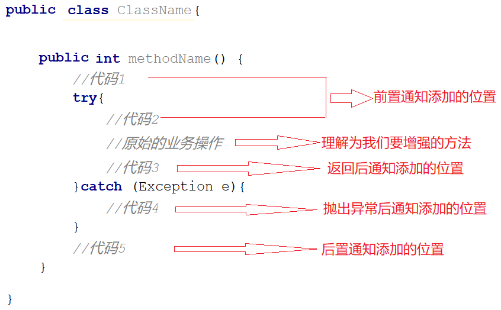
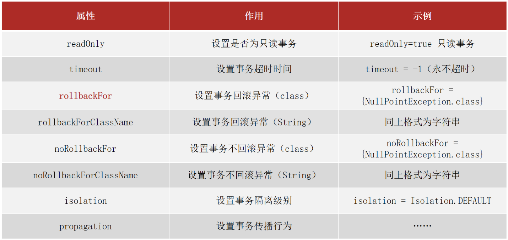

## AOP 概念和原理
### 什么是 AOP

AOP(Aspect Oriented Programming)面向切面编程：一种编程范式，在不改原有代码的前提下对其进行增强

### 术语概念

**连接点（Join Point）**：连接点是程序执行过程中可以插入切面的具体位置，如方法调用或异常抛出。Spring AOP 只支持方法级别的连接点。
**切入点（Pointcut）**：切入点定义了在哪些连接点上执行通知。切入点表达式用于匹配连接点。
**通知（Advice）**：通知定义了切面实际要执行的动作。通知定义在通知类中
**切面(Aspect)**：描述通知与切入点的对应关系。

代理（Proxy）：SpringAOP 的核心本质是采用代理模式实现的

### Spring AOP 最小单元

添加依赖：spring-context 和 aspectjweaver
- Java-中间件-Maven依赖版本

1. 在 Spring 注解类添加： `@EnableAspectJAutoProxy` 注解
2. 创建切面类，使用 `@Aspect` 注解标识
3. 在切面类中定义切入点 Pointcut 方法，并添加 `@Pointcut` 注解
4. 在切面类中定义通知方法，并用  `@Before` ， `@After` ， `@Around` 等注解绑定到切入点。这些通知会在切入点执行前/后/前后执行

切面类：例如统计方法执行时间的切面类
```Java
@Component
@Aspect
public class MyAdvice {

    @Pointcut("execution(* com.itheima.dao.BookDao.*d*(..))")
    private void pt(){}

    @Around("pt()")
    public Object around(ProceedingJoinPoint pjp) throws Throwable {
        System.out.println("------------------------------");
        Long startTime = System.currentTimeMillis();
        for (int i = 0 ; i<10000 ; i++) {
            //调用原始操作
            pjp.proceed();
        }
        Long endTime = System.currentTimeMillis();
        Long totalTime = endTime-startTime;
        System.out.println("执行万次消耗时间：" + totalTime + "ms");
        return null;
    }

}
```

涉及的注解如下：

| 名称 | @EnableAspectJAutoProxy |
| ---- | ----------------------- |
| 类型 | 配置类注解              |
| 位置 | 配置类定义上方          |
| 作用 | 开启注解格式 AOP 功能     |


| 名称 | @Aspect               |
| ---- | --------------------- |
| 类型 | 类注解                |
| 位置 | 切面类定义上方        |
| 作用 | 设置当前类为 AOP 切面类 |


| 名称 | @Pointcut                   |
| ---- | --------------------------- |
| 类型 | 方法注解                    |
| 位置 | 切入点方法定义上方          |
| 作用 | 设置切入点方法              |
| 属性 | value（默认）：切入点表达式 |

| 名称 | @Before                                                      |
| ---- | ------------------------------------------------------------ |
| 类型 | 方法注解                                                     |
| 位置 | 通知方法定义上方                                             |
| 作用 | 设置当前通知方法与切入点之间的绑定关系，当前通知方法在原始切入点方法前运行 |

### AOP 的执行逻辑

- Spring 容器启动
	- 加载被增强的类
	- 加载通知类
- 读取所有切面类中的切入点
- 匹配切入点，初始化 Bean：
	- 把要被实例化 bean 对象的类中的方法和切入点进行匹配
	- 为匹配成功的方法创建原始对象（目标对象）的代理对象，后续运行的方法将会是代理对象的方法

## SpringAOP 配置

### 切入点描述
切入点的完整定义实例：
```Java
@Pointcut("execution(* com.itheima.dao.BookDao.*d*(..))")
private void pt(){}
```

**切入点表达式**：Pointcut 注解中的 Value 属性的内容，类似于正则表达式，用于匹配要增强的方法，例如这里的字符串 `"execution(* com.itheima.dao.BookDao.*d*(..))"` 

**切入点**：依托一个不具有实际意义的方法（无参数、无返回值、方法体无实际逻辑）描述。例如这里的 pt 方法就是一个切入点

#### 语法格式

切入点表达式标准格式：类似于 C 函数原型的写法：
- 动作关键字(访问修饰符 returnType 包名.类名或接口名.方法名(参数) 异常名）
- 这里的方法可以是接口的方法，也可以是接口实现的方法，例如以下表述等价
```java
// 接口
@Pointcut(execution(void com.itheima.dao.BookDao.update())) 
//接口实现类
@Pointcut(execution(void com.itheima.dao.impl.BookDaoImpl.update())) 
```

一个例子：
```
execution(public User com.itheima.service.UserService.findById(int))
```
* execution：动作关键字，描述切入点的行为动作，例如 execution 表示执行到指定切入点
* public:访问修饰符,还可以是 public，private 等，可以省略 
* User：返回值，写返回值类型
* com.itheima.service：包名，多级包使用点连接（一般不用..匹配，效率低）
* UserService:类/接口名称（优先匹配接口避免深度耦合）
* findById：方法名
* int:参数，直接写参数的类型，多个类型用逗号隔开
* 异常名：方法定义中抛出指定异常，可以省略（一般不用这个匹配）

#### 通配符

* `*` :单个独立的任意符号，可以独立出现，也可以作为前缀或者后缀的匹配符出现
	- 匹配 com.itheima 包下的任意包中的 UserService 类或接口中所有 find 开头的带有一个参数的方法：
```
execution（public * com.itheima.*.UserService.find*(*))
```

* `..` ：多个连续的任意符号，可以独立出现，常用于简化包名与参数的书写
	* 匹配 com 包下的任意包中的 UserService 类或接口中所有名称为 findById 的方法：
```
execution（public User com..UserService.findById(..))
```

* `+` ：专用于匹配子类类型：
	* Service+，表示所有以 Service 结尾的接口的子类
```
execution(* *..*Service+.*(..))
```

### 通知

**书写方法**：在方法前添加通知注解，通知注解包含通知类型、切入点
```Java
@Before("pt()")
public void before() {
    System.out.println("before advice ...");
}
```

5 **种通知类型和插入的位置**：
- @Before：追加功能到方法执行前
- @After：追加功能到方法执行后，无论方法是否正常完成都会运行
- @AfterReturning：方法成功执行后运行
- @AfterThrowing：方法执行失败后运行
- @Around：追加功能到方法执行的前后，可以实现剩下四种通知的功能



#### Around 通知

环绕通知方法依赖形参 ProceedingJoinPoint 实现对原始方法的调用，进而实现原始方法调用前后同时添加通知
- 调用该对象的 proceed 方法即为调用原始操作
- 对原始方法的调用可以不接收返回值，通知方法设置成 void 即可，如果接收返回值，最好设定为 Object 类型
- 由于无法预知原始方法运行后是否会抛出异常，因此环绕通知方法必须要处理 Throwable 异常

```Java  
@Pointcut("execution(void com.itheima.dao.BookDao.update())") 
private void pt(){}

@Around("pt()")
public Object around(ProceedingJoinPoint pjp) throws Throwable {
    System.out.println("around before advice ...");
    
    //获取执行签名信息
    Signature signature = pjp.getSignature();
    //通过签名获取执行操作名称(接口名)
    String className = signature.getDeclaringTypeName();
    //通过签名获取执行操作名称(方法名)
    String methodName = signature.getName();
    
    try{
    	//表示对原始操作的调用，获取返回值
	     Object ret = pjp.proceed();
    }catch(Throwable throwable){
    	//获取原始操作的异常
        t.printStackTrace();
    }
    System.out.println("around after advice ...");
    return ret;
}
```

#### 获取参数

五类通知获取参数的方法一致：
- 对于 `前置` 、 `后置` 、 `返回后` 、 `抛出异常后` 这四类通知，需要在方法上添加形参 JoinPoint，通过 JoinPoint 来获取参数
- 环绕通知本身就需要形参 ProceedingJoinPoint，因为ProceedingJoinPoint是JoinPoint类的子类，所以对于ProceedingJoinPoint类中也有对应的 `getArgs()` 方法
```Java
@Component
@Aspect
public class MyAdvice {
    @Pointcut("execution(* com.itheima.dao.BookDao.findName(..))")
    private void pt(){}

    @Before("pt()")
    public void before(JoinPoint jp) 
        Object[] args = jp.getArgs();
        System.out.println(Arrays.toString(args));
        System.out.println("before advice ..." );
    }
	//...其他的略
}
```

**特别的，环绕通知还可以修改传给原方法的参数**：
- ProceedingJoinPoint.proceed()：
	- 当原始方法有参数，会在调用的过程中自动传入参数
	- 也可以手动传入参数
```Java
@Around("pt()")
public Object around(ProceedingJoinPoint pjp) throws Throwable{
    Object[] args = pjp.getArgs();
    args[0] = 666;
    Object ret = pjp.proceed(args);
    return ret;
}
```

#### 获取返回值

返回后通知：
```Java
@Component
@Aspect
public class MyAdvice {
    @Pointcut("execution(* com.itheima.dao.BookDao.findName(..))")
    private void pt(){}

    @AfterReturning(value = "pt()",returning = "ret")
    public void afterReturning(Object ret) {
        System.out.println("afterReturning advice ..."+ret);
    }
	//其他的略
}
```


#### 获取异常

抛出异常后通知获取异常：
```java
@Component
@Aspect
public class MyAdvice {
    @Pointcut("execution(* com.itheima.dao.BookDao.findName(..))")
    private void pt(){}

    @AfterThrowing(value = "pt()",throwing = "t")
    public void afterThrowing(Throwable t) {
        System.out.println("afterThrowing advice ..."+t);
    }
	//其他的略
}
```


## Spring 事务

事务：同一事务中的操作，要么同时成功，要么同时失败，失败时需要让事务进行回滚

Spring 的事务是对数据库事务在业务层上的封装
### Spring 事务的原理

考虑 A 向 B 的转账过程，包含两个动作：
- A 转出
- B 转入

启用 Spring 事务管理前，该业务过程如下：
- A 转出：发起一个数据库事务 T1，扣除 A 的账户余额
- B 转入：再发起一个数据库事务 T2，增加 B 的账户余额
- 两步分别是两个事务，彼此不相关，T2 的失败不会导致 T1 回滚

启用 Spring 事务管理后，该业务过程如下：
- transfer 方法上添加了@Transactional 注解，在该方法上就会有一个事务 T
- A 转出：发起一个数据库事务 T1 加入 transfer 方法的事务 T，扣除 A 的账户余额
- B 转入：发起一个数据库事务 T2 加入 transfer 方法的事务 T，增加 B 的账户余额
- T1，T2 在同一个事务中，当业务层中出现异常，整个事务 T 就会回滚，保证数据的一致性

- **事务管理员**：发起事务方，在 Spring 中通常指代业务层开启事务的方法
- **事务协调员**：加入事务方，在 Spring 中通常指代数据层方法，也可以是业务层方法

### 基本实现步骤
Spring 事务管理具体的实现步骤为：
1. 若某方法对应一整个事务流程，则为其添加@Transactional 注释，为当前业务层方法添加事务
	1. 可以写在接口类、接口方法、实现类、实现方法前
	2. 如果设置在类或接口上方则类或接口中所有方法均添加事务
	3. 建议写在实现类或实现类的方法上
3. 在数据库配置类中配置事务管理器，例如Mybatis框架使用的是JDBC事务，可以直接使用 `DataSourceTransactionManager`
4. 在主配置类添加注解 `@EnableTransactionManagement` ，设置当前 Spring 环境中开启注解式事务支持

#### 配置事务方法
```Java
public interface AccountService {
    /**
     * 转账操作
     * @param out 传出方
     * @param in 转入方
     * @param money 金额
     */
    //配置当前接口方法具有事务
    public void transfer(String out,String in ,Double money) ;
}

@Service
public class AccountServiceImpl implements AccountService {

    @Autowired
    private AccountDao accountDao;
	@Transactional
    public void transfer(String out,String in ,Double money) {
        accountDao.outMoney(out,money);
        int i = 1/0;
        accountDao.inMoney(in,money);
    }

}
```

#### 配置事务管理器
```Java
public class JdbcConfig {
    @Value("${jdbc.driver}")
    private String driver;
    @Value("${jdbc.url}")
    private String url;
    @Value("${jdbc.username}")
    private String userName;
    @Value("${jdbc.password}")
    private String password;

    @Bean
    public DataSource dataSource(){
        DruidDataSource ds = new DruidDataSource();
        ds.setDriverClassName(driver);
        ds.setUrl(url);
        ds.setUsername(userName);
        ds.setPassword(password);
        return ds;
    }

    //配置事务管理器，mybatis使用的是jdbc事务
    @Bean
    public PlatformTransactionManager transactionManager(DataSource dataSource){
        DataSourceTransactionManager transactionManager = new DataSourceTransactionManager();
        transactionManager.setDataSource(dataSource);
        return transactionManager;
    }
}
```

#### 启用事务管理器
```Java
@Configuration
@ComponentScan("com.itheima")
@PropertySource("classpath:jdbc.properties")
@Import({JdbcConfig.class,MybatisConfig.class
//开启注解式事务驱动
@EnableTransactionManagement
public class SpringConfig {
}
```

### @Transactional 配置参数



* readOnly：true 只读事务，false 读写事务，增删改要设为 false,查询设为 true。
* timeout:设置超时时间单位秒，在多长时间之内事务没有提交成功就自动回滚，-1 表示不设置超时时间。
* rollbackFor:当出现指定异常进行事务回滚
	- Spring的事务只会对 `Error异常` 和 `RuntimeException异常` 及其子类进行事务回顾，其他的异常类型是不会回滚的。此时就可以使用 rollbackFor 属性来设置出现 IOException 异常不回滚
* noRollbackFor:当出现指定异常不进行事务回滚
* isolation 设置事务的隔离级别
	* DEFAULT   :默认隔离级别, 会采用数据库的隔离级别
	* READ_UNCOMMITTED : 读未提交
	* READ_COMMITTED : 读已提交
	* REPEATABLE_READ : 重复读取
	* SERIALIZABLE: 串行化

```java
// rollbackFor的用法案例
@Service
public class AccountServiceImpl implements AccountService {

  @Autowired
  private AccountDao accountDao;
  
  @Transactional(rollbackFor = {IOException.class})
  public void transfer(String out,String in ,Double money) throws IOException{
	  accountDao.outMoney(out,money);
	  //int i = 1/0; //这个异常事务会回滚
	  if(true){
		  throw new IOException(); //这个异常事务就不会回滚
	  }
	  accountDao.inMoney(in,money);
  }

}
```

#### 事务的传播行为

Spring 事务传播机制是指，包含多个事务的方法在相互调用时，事务是如何在这些方法间传播的，通过@Transactional(propagation = Propagation.XXX)配置。

Spring 的事务传播机制主要分为三类，一类是支持当前事务，一类是不支持当前事务，一类是嵌套事务。
- 延续当前事务的：
	- Propagation.**REQUIRED**：默认的事务传播级别，它表示如果当前存在事务，则加入该事务；如果当前没有事务，则创建一个新的事务
	- Propagation.**SUPPORTS**：如果当前存在事务，则加入该事务；如果当前没有事务，则以非事务的方式继续运行
	- Propagation.**MANDATORY**：如果当前存在事务，则加入该事务；如果当前没有事务，则抛出异常
- 不延续当前事务的：
	- Propagation.**REQUIRES_NEW**：新开启自己的事务，且开启的事务相互独立，互不干扰
	- Propagation.**NOT_SUPPORTED**：以非事务方式运行，如果当前存在事务，则把当前事务挂起
	- Propagation.**NEVER**：以非事务方式运行，如果当前存在事务，则抛出异常
- 嵌套事务：
	- Propagation.**NESTED**：如果当前存在事务，则创建一个事务作为当前事务的嵌套事务来运行；如果当前没有事务，则该取值等价于 Propagation.REQUIRED。