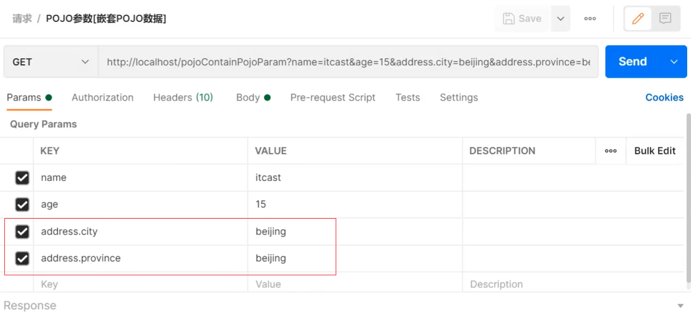
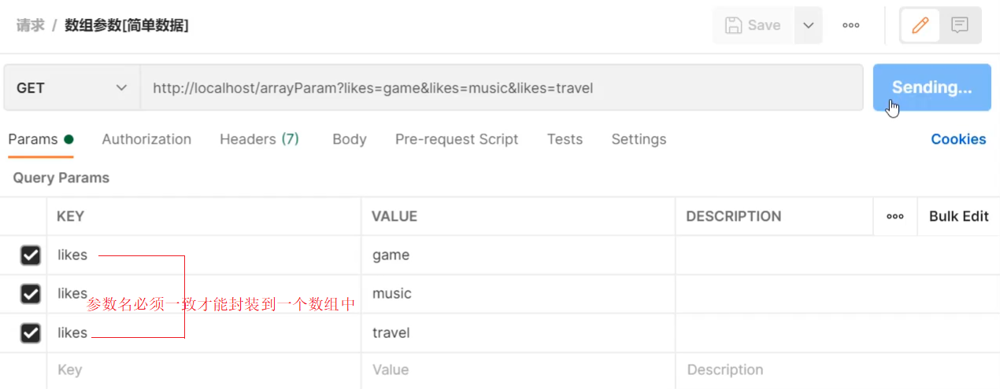
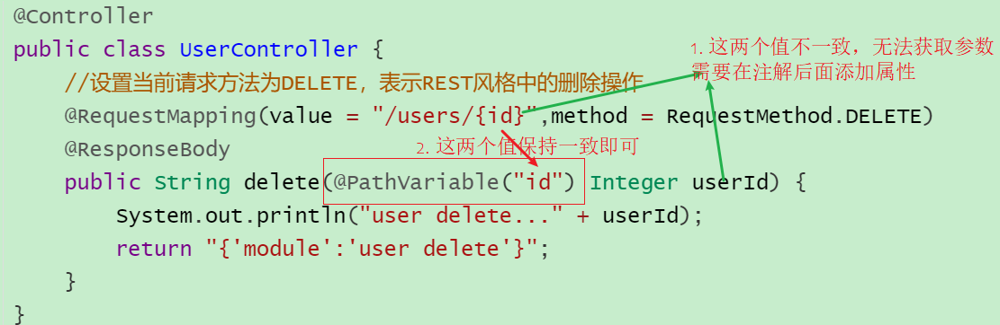
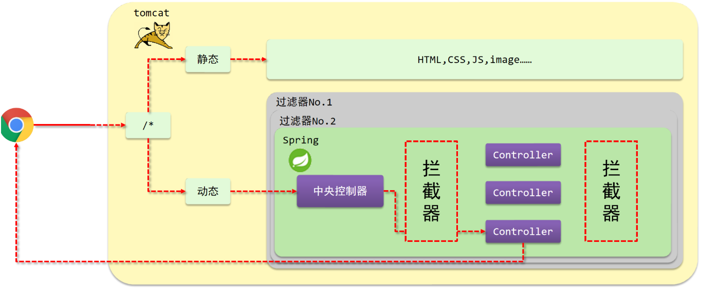
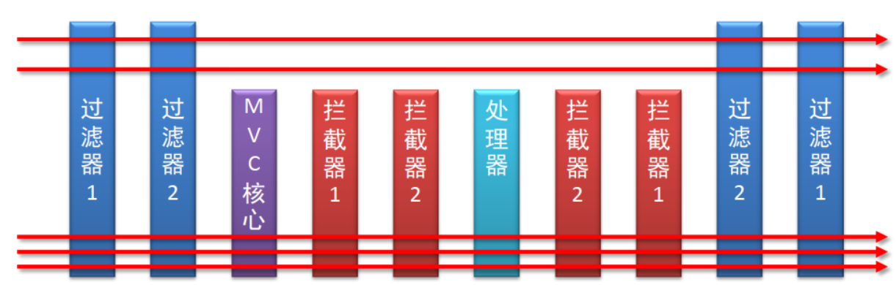
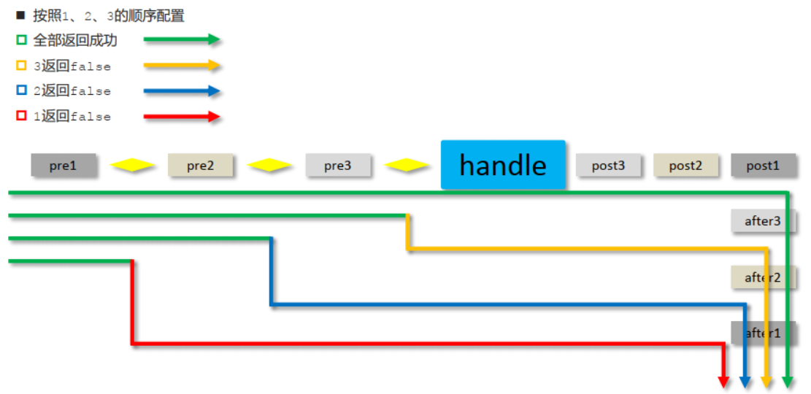

### 什么是 SpringMVC

SpringMVC 是处于 Web 层的框架，是对 Servlet 进行了封装。，所以其主要的作用就是用来接收前端发过来的请求和数据然后经过处理并将处理的结果响应给前端，所以如何处理请求和响应是 SpringMVC 中非常重要的一块内容。

什么是 MVC：
- 早期的 WEB 服务器：将后端服务器Servlet拆分成三层，分别是 `web` 、 `service` 和 `dao`
	* web层主要由servlet来处理，负责页面请求和数据的收集以及响应结果给前端
	* service层主要负责业务逻辑的处理
	* dao层主要负责数据的增删改查操作

- 后端渲染+MVC 模式：将 web 层设计为 `controller` 、 `view` 和 `Model`
	* controller负责请求和数据的接收，接收后将其转发给service进行业务处理
	* service根据需要会调用dao对数据进行增删改查
	* dao把数据处理完后将结果交给service,service再交给controller
	* controller根据需求组装成Model和View，Model和View组合起来生成页面转发给前端浏览器

- 前端渲染+MVC 模式：后端不再渲染 View
	- controller 接收请求和数据，转发给业务层
	- 再将业务层响应编码并转发给前端


### FirstExample

#### POM
 **导入 spring-webmvc 和 javax.servlet-api 的引用**
 - 注意 servlet 的 scope 需要限制为 provide（编译和测试时有效）。因为 tomcat 中已有 servlet-api 包，若导入的这个包运行时也有效则会发生冲突
```
<!-- https://mvnrepository.com/artifact/javax.servlet/javax.servlet-api -->
<dependency>
    <groupId>javax.servlet</groupId>
    <artifactId>javax.servlet-api</artifactId>
    <version>4.0.1</version>
    <scope>provided</scope>
</dependency>
<!-- https://mvnrepository.com/artifact/org.springframework/spring-webmvc -->
<dependency>
    <groupId>org.springframework</groupId>
    <artifactId>spring-webmvc</artifactId>
    <version>6.2.1</version>
</dependency>
```

#### 配置类

主配置类：启用包扫描
```
@Configuration
@ComponentScan("com.itheima.controller")
public class SpringMvcConfig {
}
```

**web 配置类**：完成以下工作
- 应用初始化：初始化 WebApplicationContext
- 设置由 springmvc 控制器处理的请求映射路径：getServletMappings

方法 A：指定 Spring 配置类，自动初始化环境：继承 AbstractAnnotationConfigDispatcherServletInitializer
```Java
public class ServletContainersInitConfig extends AbstractAnnotationConfigDispatcherServletInitializer {

    protected Class<?>[] getRootConfigClasses() {
        return new Class[]{SpringConfig.class};
    }

    protected Class<?>[] getServletConfigClasses() {
        return new Class[]{SpringMvcConfig.class};
    }

    protected String[] getServletMappings() {
        return new String[]{"/"};
    }
}
```

方法 B：手动初始化环境：实现 AbstractDispatcherServletInitializer 类的三个 Abstract 的方法：
```Java
public class ServletContainersInitConfig extends AbstractDispatcherServletInitializer {
    //加载springmvc配置类，产生springmvc容器（本质还是spring容器）
    protected WebApplicationContext createServletApplicationContext() {
        //初始化WebApplicationContext对象
        AnnotationConfigWebApplicationContext ctx = new AnnotationConfigWebApplicationContext();
        //加载指定配置类
        ctx.register(SpringMvcConfig.class);
        return ctx;
    }

    //设置由springmvc控制器处理的请求映射路径
    protected String[] getServletMappings() {
        return new String[]{"/"};
    }

    //加载spring配置类
    protected WebApplicationContext createRootApplicationContext() {
        return null;
    }
}
```

#### 控制器类

| 名称 | @Controller                   |
| ---- | ----------------------------- |
| 类型 | 类注解                        |
| 位置 | SpringMVC 控制器类定义上方     |
| 作用 | 设定 SpringMVC 的核心控制器 bean |


| 名称     | @RequestMapping                 |
| -------- | ------------------------------- |
| 类型     | 类注解或方法注解                |
| 位置     | SpringMVC 控制器类或方法定义上方 |
| 作用     | 设置当前控制器方法请求访问路径  |
| 相关属性 | value(默认)，请求访问路径       |


| 名称 | @ResponseBody                                    |
| ---- | ------------------------------------------------ |
| 类型 | 类注解或方法注解                                 |
| 位置 | SpringMVC 控制器类或方法定义上方                  |
| 作用 | 设置当前控制器方法响应内容为当前返回值，无需解析 |

```Java
@Controller
public class UserController {

    //设置映射路径为/save，即外部访问路径
    @RequestMapping("/save")
    //设置当前操作返回结果为指定json数据（本质上是一个字符串信息）
    @ResponseBody
    public String save(){
        System.out.println("user save ...");
        return "{'info':'springmvc'}";
    }

    //设置映射路径为/delete，即外部访问路径
    @RequestMapping("/delete")
    @ResponseBody
    public String delete(){
        System.out.println("user save ...");
        return "{'info':'springmvc'}";
    }
}
```

- 如果方法直接返回字符串，springmvc 会把字符串当成页面的名称在项目中进行查找返回，因为不存在对应返回值名称的页面，所以会报 404 错误，找不到资源
- @ResponseBody 注解声明方法返回的字符串是请求体的内容

#### SpringMVC 生命周期

服务器启动：
- 执行 ServletContainersInitConfig 类，初始化 web 容器
- 执行 createServletApplicationContext 方法，创建了 WebApplicationContext 对象
	- 其中我们编码创建了AnnotationConfigWebApplicationContext 上下文（WebApplicationContext 的子类）
	- 再加载了 SpringMvcConfig 配置类
- Spring 容器执行包扫描
- 加载所有的控制器类，检查 @RequestMapping 注解注册

单次请求过程：
1. 发送请求 `http://localhost/save`
2. web容器发现该请求满足SpringMVC拦截规则，将请求交给SpringMVC处理
3. 解析请求路径/save
4. 由/save匹配执行对应的方法save(），调用 save()处理请求
6. 检测到有@ResponseBody直接将save()方法的返回值作为响应体返回给请求方

### SpringMVC 的包扫描

Spring 的配置类和 SpringMVC 的配置类均需要加载资源，应当让两者只加载自己的内容
- SpringMVC 的配置类只加载控制器类：
	- 方法是在其配置类指定@ComponentScan 的值为存储控制器类的包
- Spring 的配置类只加载**业务 Bean**（Service） 和**功能 Bean**（DataSource,SqlSessionFactoryBean,MapperScannerConfigurer...）：
	- 方法是在其配置类指定@ComponentScan 时排除特定的 Class


#### 包扫描的控制

示例项目结构：
```
main
 ├─java
 │  └─com
 │      └─itheima
 │          ├─config：存Spring配置类
 │          ├─controller
 │          ├─dao：数据库DAO
 │          ├─domain
 │          └─service：服务接口
 │              └─impl：服务实现
 └──resources
```

加载类：
* excludeFilters 属性：设置扫描加载 bean 时，排除的过滤规则
* type 属性：设置排除规则，当前使用按照 bean 定义时的注解类型进行排除
	* ANNOTATION：按照注解排除
	* ASSIGNABLE_TYPE:按照指定的类型过滤
	* ASPECTJ:按照 Aspectj 表达式排除，基本上不会用
	* REGEX:按照正则表达式排除
	* CUSTOM:按照自定义规则排除
* classes 属性：设置排除的具体注解类，当前设置排除@Controller 定义的 bean
```Java
@Configuration
//方法1：精确导入特定的包：@ComponentScan({"com.itheima.service","com.itheima.dao"})
//方法2：设置spring配置类加载bean时的过滤规则，当前要求排除掉表现层对应的bean
@ComponentScan(value="com.itheima",
    excludeFilters = @ComponentScan.Filter(
        type = FilterType.ANNOTATION, // type属性：设置排除规则
        classes = Controller.class //classes属性：设置排除的具体注解类
    )
)
public class SpringConfig {
}
```

#### 检查目标类是否被成功排除

尝试从对应环境中 getBean：
```Java
public class App{
	public static void main (String[] args){
        AnnotationConfigApplicationContext ctx = new AnnotationConfigApplicationContext(SpringConfig.class);
        System.out.println(ctx.getBean(UserController.class));
    }
}
```


## 请求与响应

### 映射路径配置

配置方法：
1. 直接在方法上配置@RequestMapping
2. 多级路由：同时在控制器类和其中方法上配置@RequestMapping，实际路径是控制器类配置的路径+方法配置的路径

```Java
@Controller
public class BookController {

    @RequestMapping("/book/save")
    @ResponseBody
    public String save(){
        System.out.println("book save ...");
        return "{'module':'book save'}";
    }
}
```

```Java
@Controller
@RequestMapping("/user")
public class UserController {

    @RequestMapping("/save")
    @ResponseBody
    public String save(){
        System.out.println("user save ...");
        return "{'module':'user save'}";
    }
}
```

### 请求参数和表单参数

对于路径参数和 Content-Type 为 application/x-www-form-urlencoded 的表单参数，有可以通过以下方式接收：

#### 逐个接收

在处理方法的形参列表中逐个定义参数，适用于 URL 路径参数以及表单参数
- url 路径传参，地址参数名与形参变量名相同
- 表单参数，Content-Type 为 application/x-www-form-urlencoded
```Java
@RequestMapping("/commonParam")
@ResponseBody
public String commonParam(String name ,int age){
    System.out.println("普通参数传递 name ==> "+name);
    System.out.println("普通参数传递 age ==> "+age);
    return "{'module':'common param'}";
}
```

**若形参和路径参数不一致**，需为形参配置@RequestParam 注解指定实际的路径参数名称：
```Java
@RequestMapping("/commonParamDifferentName")
@ResponseBody
public String commonParamDifferentName(@RequestParam("name") String userName , int age){
    System.out.println("普通参数传递 userName ==> "+userName);
    System.out.println("普通参数传递 age ==> "+age);
    return "{'module':'common param different name'}";
}
```

#### 单个 POJO 对象

请求参数名与形参对象属性名相同，定义 POJO 类型形参即可接收参数
- POJO 对象
```Java
public class User {
    private String name;
    private int age;
    //setter...getter...略
}
```
- Handler：
```Java
//POJO参数：请求参数与形参对象中的属性对应即可完成参数传递
@RequestMapping("/pojoParam")
@ResponseBody
public String pojoParam(User user){
    System.out.println("pojo参数传递 user ==> "+user);
    return "{'module':'pojo param'}";
}
```

#### 嵌套 POJO 对象

请求参数名与形参对象属性名相同，按照对象层次结构关系即可接收嵌套 POJO 属性参数
- 嵌套 POJO 对象
```Java
public class Address {
    private String province;
    private String city;
    //setter...getter...略
}
public class User {
    private String name;
    private int age;
    private Address address;
    //setter...getter...略
}
```
- 后台接收参数:
```java
//POJO参数：请求参数与形参对象中的属性对应即可完成参数传递
@RequestMapping("/pojoParam")
@ResponseBody
public String pojoParam(User user){
    System.out.println("pojo参数传递 user ==> "+user);
    return "{'module':'pojo param'}";
}
```

- 请求样式：


#### 数组

请求参数名与形参对象属性名相同且请求参数为多个，定义数组类型即可接收参数
- 接收参数：
```java
//数组参数：同名请求参数可以直接映射到对应名称的形参数组对象中
@RequestMapping("/arrayParam")
@ResponseBody
public String arrayParam(String[] likes){
	System.out.println("数组参数传递 likes ==> "+ Arrays.toString(likes));
	return "{'module':'array param'}";
}
```
- 请求样式：


#### 集合

SpringMVC 将 List 看做是一个 POJO 对象来处理，将其创建一个对象并准备把前端的数据封装到对象中，但是 List 是一个接口无法创建对象，所以报错。

解决方案是:使用 `@RequestParam` 注解

```java
//集合参数：同名请求参数可以使用@RequestParam注解映射到对应名称的集合对象中作为数据
@RequestMapping("/listParam")
@ResponseBody
public String listParam(@RequestParam List<String> likes){
    System.out.println("集合参数传递 likes ==> "+ likes);
    return "{'module':'list param'}";
}
```

#### 参数乱码问题

**路径参数**：在 URL 路径中形如?param=xxx
- 路径参数中的中文字符若出现乱码，则需要指定 Tomcat 的 uriEncoding 为 UTF-8
	- Tomcat8.5 以后默认为 UTF8

**编码表单参数**：Content-Type	为 application/x-www-form-urlencoded

- 若 Body 参数出现乱码，需配置过滤器设置 Encoding
```java
public class ServletContainersInitConfig extends AbstractAnnotationConfigDispatcherServletInitializer {
    protected Class<?>[] getRootConfigClasses() {
        return new Class[0];
    }

    protected Class<?>[] getServletConfigClasses() {
        return new Class[]{SpringMvcConfig.class};
    }

    protected String[] getServletMappings() {
        return new String[]{"/"};
    }

    //乱码处理
    @Override
    protected Filter[] getServletFilters() {
        CharacterEncodingFilter filter = new CharacterEncodingFilter();
        filter.setEncoding("UTF-8");
        return new Filter[]{filter};
    }
}
```
#### 日期时间参数
使用 `@DateTimeFormat` 指定接收的日期时间格式：
- Spring 默认可以处理 yyyy/mm/dd 形式的日期，这种情况无需提供
```java
//使用@DateTimeFormat注解设置日期类型数据格式，默认格式yyyy/MM/dd
@RequestMapping("/dataParam")
@ResponseBody
public String dataParam(Date date,
                        @DateTimeFormat(pattern="yyyy-MM-dd") Date date1,
                        @DateTimeFormat(pattern="yyyy/MM/dd HH:mm:ss") Date date2){
    System.out.println("参数传递 date ==> "+date);
    System.out.println("参数传递 date1(yyyy-MM-dd) ==> "+date1);
    System.out.println("参数传递 date2(yyyy/MM/dd HH:mm:ss) ==> "+date2);
    return "{'module':'data param'}";
}
```

| 名称     | @DateTimeFormat                 |
| -------- | ------------------------------- |
| 类型     | ==形参注解==                    |
| 位置     | SpringMVC 控制器方法形参前面     |
| 作用     | 设定日期时间型数据格式          |
| 相关属性 | pattern：指定日期时间格式字符串 |
#### JSON 请求

Spring 处理 JSON 参数需要 2 步额外的配置：
1. 添加 Jackson 依赖： Java-中间件-Maven依赖版本
2. 在 MVC 配置类中添加@EnableWebMvc 注解，其中包含了将 JSON 转换成对象的功能

配置完成后，Spring MVC 会自动通过 `HttpMessageConverter` 将请求的JSON数据转换成Java对象，用户可以像处理表单参数一样处理 JSON 参数：

- **接收单个参数**
```Java
@RequestMapping("/pojoParamForJson")
@ResponseBody
public String pojoParamForJson(@RequestBody User user){
    System.out.println("pojo(json)参数传递 user ==> "+user);
    return "{'module':'pojo for json param'}";
}
```

请求体：Content-Type	application/json
```JSON
{
	"name":"itcast",
	"age":15,
    "address":{
        "province":"beijing",
        "city":"beijing"
    }
}
```

- **接收集合参数**：
```java
@RequestMapping("/listPojoParamForJson")
@ResponseBody
public String listPojoParamForJson(@RequestBody List<User> list){
    System.out.println("list pojo(json)参数传递 list ==> "+list);
    return "{'module':'list pojo for json param'}";
}
```

请求体：Content-Type	application/json
```json
[
    {"name":"itcast","age":15},
    {"name":"itheima","age":12}
]
```


#### 比较 RequestBody 和 RequestParam

##### @RequestBody 注解

| 名称  | @RequestBody                                             |
| --- | -------------------------------------------------------- |
| 类型  | ==形参注解==                                                 |
| 位置  | SpringMVC 控制器方法形参定义前面                                    |
| 作用  | **接收 json 传参**，将请求中请求体所包含的数据传递给请求参数，<br>此注解一个处理器方法只能使用一次 |
```Java
// 使用@RequestBody注解将外部传递的json数组数据映射到形参的集合对象中作为数据
@RequestMapping("/listParamForJson")
@ResponseBody
public String listParamForJson(@RequestBody List<String> likes){
    System.out.println("list common(json)参数传递 list ==> "+likes);
    return "{'module':'list common for json param'}";
}
```
##### @RequestParam 注解

| 名称   | @RequestParam                                                |
| ---- | ------------------------------------------------------------ |
| 类型   | 形参注解                                                         |
| 位置   | SpringMVC 控制器方法形参定义前面                                        |
| 作用   | 绑定请求参数与处理器方法形参间的关系                                           |
| 相关参数 | **接收 url 地址传参**，<br>required：是否为必传参数 <br/>defaultValue：参数默认值 |
```Java
@RequestMapping("/commonParam")
@ResponseBody
public String commonParam(String name ,int age){
    System.out.println("普通参数传递 name ==> "+name);
    System.out.println("普通参数传递 age ==> "+age);
    return "{'module':'common param'}";
}
```

### 路径参数和RESTful

#### RESTful 风格
- **CS 模型**：REST 架构遵循客户端-服务器的模型，客户端和服务器分离。客户端负责用户界面和用户体验，服务器负责数据存储和业务逻辑。这样一来，客户端和服务器的变化是相互独立的。
- **无状态**（Stateless）：每个请求都是独立的，服务器不存储客户端的状态。所有的必要信息都应该包含在请求中，服务器不会保留请求之间的任何状态信息。这使得每次请求都是完全独立的，服务器不需要记住过去的请求。
- **可缓存**（Cacheable）：客户端的响应可以被缓存，从而提高性能。响应必须明确标示是否可以缓存。如果响应是可缓存的，客户端或中间缓存（如代理）可以存储响应数据，以减少对服务器的请求。
- **统一接口**（Uniform Interface）：REST 要求使用统一的接口来进行交互。具体包括：
	- 通过 URL 标识资源，使用 HTTP 动词（GET、POST、PUT、DELETE 等）进行操作
		- 例如对于同一个用户对象的增删改查均使用/users/{id}路径，而针对请求方法不同分别处理
	- 资源通过标准的表示方式（如 JSON、XML、HTML 等）来表示。
- **分层系统**（Layered System）：客户端无法知道它是否直接与服务器交互，还是通过中间层（例如代理、负载均衡器）与服务器进行交互。分层架构能够增加系统的可扩展性和安全性。

#### 路径参数 @PathVariable



#### 利用路径参数实现统一接口

对于同一 URL 路径，可以为每种请求方法单独设置一种处理方法：
- 通过在 @RequestMapping 指定 method 实现
```java
@Controller
public class UserController {
    //设置当前请求方法为DELETE，表示REST风格中的删除操作
	@RequestMapping(value = "/users/{id}",method = RequestMethod.DELETE)
    @ResponseBody
    public String delete(@PathVariable Integer id) {
        System.out.println("user delete..." + id);
        return "{'module':'user delete'}";
    }
}
```

#### 简化书写：@RestController

**简化@RequestMapping**：对于 HTTP 动词（GET、POST、PUT、DELETE 等）Spring 均有相应的 Mapping，它们可以实现 RequestMapping 的功能


| 名称   | @GetMapping @PostMapping @PutMapping @DeleteMapping          |
| ---- | ------------------------------------------------------------ |
| 类型   | 方法注解                                                         |
| 作用   | 设置当前控制器方法请求访问路径与请求动作，每种对应一个请求动作，<br/>例如@GetMapping 对应 GET 请求 |
| 相关属性 | value（默认）：请求访问路径                                             |

| 名称  | @RestController                                                  |
| --- | ---------------------------------------------------------------- |
| 类型  | 类注解                                                              |
| 作用  | 设置当前控制器类为 RESTful 风格，<br/>等同于@Controller 与@ResponseBody 两个注解组合功能 |


```Java
//@Controller
//@ResponseBody配置在类上可以简化配置，表示设置当前每个方法的返回值都作为响应体
//@ResponseBody
@RestController     //使用@RestController注解替换@Controller与@ResponseBody注解，简化书写
@RequestMapping("/books")
public class BookController {

//    @RequestMapping( method = RequestMethod.POST)
    @PostMapping        //使用@PostMapping简化Post请求方法对应的映射配置
    public String save(@RequestBody Book book){
        System.out.println("book save..." + book);
        return "{'module':'book save'}";
    }

//    @RequestMapping(value = "/{id}" ,method = RequestMethod.DELETE)
    @DeleteMapping("/{id}")     //使用@DeleteMapping简化DELETE请求方法对应的映射配置
    public String delete(@PathVariable Integer id){
        System.out.println("book delete..." + id);
        return "{'module':'book delete'}";
    }

//    @RequestMapping(method = RequestMethod.PUT)
    @PutMapping         //使用@PutMapping简化Put请求方法对应的映射配置
    public String update(@RequestBody Book book){
        System.out.println("book update..."+book);
        return "{'module':'book update'}";
    }

//    @RequestMapping(value = "/{id}" ,method = RequestMethod.GET)
    @GetMapping("/{id}")    //使用@GetMapping简化GET请求方法对应的映射配置
    public String getById(@PathVariable Integer id){
        System.out.println("book getById..."+id);
        return "{'module':'book getById'}";
    }

//    @RequestMapping(method = RequestMethod.GET)
    @GetMapping             //使用@GetMapping简化GET请求方法对应的映射配置
    public String getAll(){
        System.out.println("book getAll...");
        return "{'module':'book getAll'}";
    }
}
```

### 响应类型

#### 返回纯文本

```java
@Controller
public class UserController {
    
   	@RequestMapping("/toText")
	//注意此处该注解就不能省略，如果省略了,会把response text当前页面名称去查找，如果没有回报404错误
    @ResponseBody
    public String toText(){
        System.out.println("返回纯文本数据");
        return "response text";
    }
    
}
```


#### 返回 JSON 对象

POM 添加 Jackson 依赖，MVC 配置类中添加@EnableWebMvc 注解后
只需返回一般 Java 对象，Spring MVC 会自动通过 `HttpMessageConverter` 将 Java 对象转为 JSON 文本

```java
@Controller
public class UserController {
    
    @RequestMapping("/toJsonPOJO")
    @ResponseBody
    public User toJsonPOJO(){
        System.out.println("返回json对象数据");
        User user = new User();
        return user;
    }
    @RequestMapping("/toJsonList")
    @ResponseBody
    public List<User> toJsonList(){
        System.out.println("返回json集合数据");
        User user1 = new User();
        User user2 = new User();
        List<User> userList = new ArrayList<User>();
        userList.add(user1);
        userList.add(user2);
    
        return userList;
    }
}
```


#### 返回 JSP 页面

```java
@Controller
public class UserController {
    
    @RequestMapping("/toJumpPage")
    //注意
    //1.此处不能添加@ResponseBody,如果加了该注入，会直接将page.jsp当字符串返回前端
    //2.方法需要返回String
    public String toJumpPage(){
        System.out.println("跳转页面");
        return "page.jsp";
    }
    
}
```

### 实现原理
#### Spring 如何实现参数的转换

通过 Converter，包路径为 org.springframework.core.convert.converter
- Converter<S, T>接口：框架中有提供很多对应 Converter 接口的实现类，用来实现不同数据类型之间的转换,如：String→Integer，String → Date
```Java
public interface Converter<S, T> {
    @Nullable
    //该方法就是将从页面上接收的数据(S)转换成我们想要的数据类型(T)返回
    T convert(S source);
}
```
- HttpMessageConverter 接口：实现对象与 JSON 之间的转换工作


## 拦截器

### 拦截器概念
拦截器：SpringMVC 提供的动态方法调用，在每个 Controller 方法执行的前后添加逻辑，且可以阻止原始方法的执行


SpringMVC Interceptor拦截器和 Servlet Filter过滤器的关系：Filter 对所有访问进行增强，Interceptor 仅针对 SpringMVC 的访问进行增强
- 两者的执行序如下



### 配置拦截器

有以下两种实现拦截器的方法：
- 定义拦截器配置类，extends WebMvcConfigurationSupport
- 定义配置类：implements WebMvcConfigurer
#### 定义拦截器配置类
- 注意这个拦截器类必须要能被 SpringMVC 配置类扫描到（含@EnableWebMvc，@Configuration 标签）
```Java
@Configuration
public class SpringMvcSupport extends WebMvcConfigurationSupport {
    @Autowired
    private ProjectInterceptor projectInterceptor;

    @Override
    protected void addResourceHandlers(ResourceHandlerRegistry registry) {
        registry.addResourceHandler("/pages/**").addResourceLocations("/pages/");
    }

    @Override
    protected void addInterceptors(InterceptorRegistry registry) {
        //配置拦截器
        registry.addInterceptor(projectInterceptor).addPathPatterns("/books","/books/*" );
    }
}
```

#### MVC 配置类实现 WebMvcConfigurer 接口

```Java
@Configuration
@ComponentScan({"com.itheima.controller"})
@EnableWebMvc
//实现WebMvcConfigurer接口可以简化开发，但具有一定的侵入性
public class SpringMvcConfig implements WebMvcConfigurer {
    @Autowired
    private ProjectInterceptor projectInterceptor;

    @Override
    public void addInterceptors(InterceptorRegistry registry) {
        //配置多拦截器
        registry.addInterceptor(projectInterceptor).addPathPatterns("/books","/books/*");
    }
}
```

### 定义拦截器处理类

- implements HandlerInterceptor，实现三个方法
	- preHandle
	- postHandle
	- afterCompletion


### 拦截链

* 当配置多个拦截器时，形成拦截器链
* 拦截器链的运行顺序参照拦截器**添加顺序**为准
* 当拦截器中出现对原始处理器的拦截，后面的拦截器均终止运行
* 当拦截器运行中断，仅运行配置在前面的拦截器的 afterCompletion 操作



## 项目相关细节

### 异常处理

1. 所有的异常均抛出到表现层进行处理
2. 使用 Spring-AOP 异常处理器，使用 @RestControllerAdvice 标识处理类
3. 使用 @ExceptionHandler(XXXException.class)标识处理方法，拦截特定的异常

```java
//@RestControllerAdvice用于标识当前类为REST风格对应的异常处理器
@RestControllerAdvice
public class ProjectExceptionAdvice {
	@ExceptionHandler(BusinessException.class)
	public Result doBusinessException(BusinessException ex){
	    return new Result(ex.getCode(),null,ex.getMessage());
	}
	
	//除了自定义的异常处理器，保留对Exception类型的异常处理，用于处理非预期的异常
	@ExceptionHandler(Exception.class)
	public Result doOtherException(Exception ex){
	    //记录日志
	    //发送消息给运维
	    //发送邮件给开发人员,ex对象发送给开发人员
	    return new Result(Code.SYSTEM_UNKNOW_ERR,null,"系统繁忙，请稍后再试！");
	}
}
```

| 名称 | @RestControllerAdvice              |
| ---- | ---------------------------------- |
| 类型 | ==类注解==                         |
| 位置 | Rest 风格开发的控制器增强类定义上方 |
| 作用 | 为 Rest 风格开发的控制器类做增强     |

| 名称 | @ExceptionHandler                                            |
| ---- | ------------------------------------------------------------ |
| 类型 | ==方法注解==                                                 |
| 位置 | 专用于异常处理的控制器方法上方                               |
| 作用 | 设置指定异常的处理方案，功能等同于控制器方法，<br/>出现异常后终止原始控制器执行,并转入当前方法执行 |

